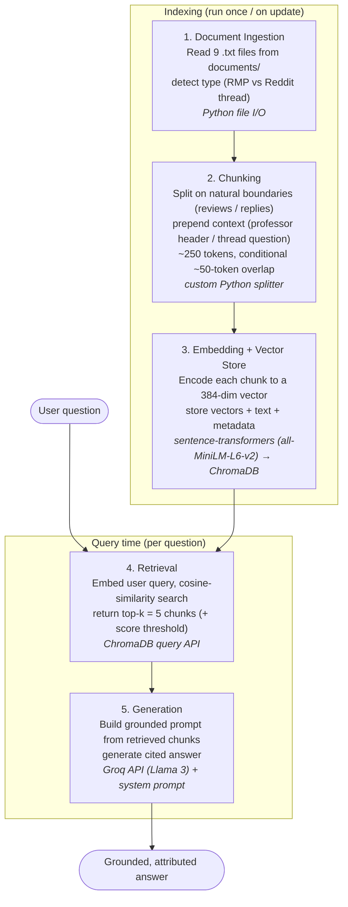

# Project 1 Planning: The Unofficial Guide

> Write this document before you write any pipeline code.
> Your spec and architecture diagram are what you'll use to direct AI tools (Claude, Copilot, etc.) to generate your implementation — the more specific they are, the more useful the generated code will be.
> Update the Retrieval Approach and Chunking Strategy sections if you change your approach during implementation.
> Update this file before starting any stretch features.

---

## Domain

**Chosen Domain**: Student reviews and unofficial advice about CS/EECS courses and professors at UC Berkeley.

This system covers real student-generated knowledge about UC Berkeley’s Computer Science (CS) program — including professor teaching styles, course difficulty, workload, workload management tips, major declaration/switching experiences, and survival advice for classes like CS61A, CS61B, CS70, CS170, etc.

**Why this knowledge is valuable**: Official course catalogs and university websites only provide dry descriptions (topics covered, prerequisites). They don’t tell students which professors are engaging vs. confusing, how brutal the workload actually is, whether a class is curved harshly, or how to succeed with no prior programming experience. This “unofficial” knowledge helps students make better scheduling decisions, reduce stress, and improve their academic experience.

**Why it’s hard to find**: High-quality student insights are scattered across old Reddit threads (r/berkeley), RateMyProfessors pages, Medium posts, and Discord servers. They’re hard to search, often outdated, and mixed with noise. A RAG system makes this collective student wisdom searchable and reliable.
---

## Documents

| # | Source | Description | location | URL |
|---|--------|-------------|-----------------|-----------------|
| 1 | Rate My Professors|Best Rated RMP Professors|documets/best_rating_rmpt.txt| https://www.ratemyprofessors.com/search/professors/1072?q=*&did=11 |
| 2 | Rate My Professors| Low-rated CS professors and common complaints |documets/worst_rating_rmp.txt | https://www.ratemyprofessors.com/search/professors/1072?q=*&did=11|
| 3 | Reddit|CS70 Professor Rao|documets/cs_70_professor_rao.txt| https://www.reddit.com/r/berkeley/comments/1fvht2b/cs70_professor_rao_is_the_worst_lecturer_ever/ |
| 4 |Reddit|CS Classes Ranked by Difficulty |documets/cs_classes_ranked_difficulty.txt| https://www.reddit.com/r/berkeley/comments/179uk2u/berkeley_cs_classes_ranked_by_difficulty/ |
| 5 |Medium |CS vs EECS |documets/cs_vs_eecs.txt | https://carolynwangjy.medium.com/berkeley-cs-and-clarification-over-the-new-high-demand-major-policy-addd7ea76f89 |
| 6 |Reddit| No Programming Experience |documets/no_programming_experience.txt| https://www.reddit.com/r/berkeley/comments/118maog/what_percent_of_students_enter_berkeley_cseecs/ |
| 7 |Reddit|Concerns about being CS at Berkeley |documets/concerns_cs_at_berkley| https://www.reddit.com/r/berkeley/comments/uuhkod/concerns_about_being_cs_at_berkeley/ |
| 8 | Medium | Switching Into CS | documets/switch_into_cs.txt | https://carolynwangjy.medium.com/berkeley-cs-and-clarification-over-the-new-high-demand-major-policy-addd7ea76f89 |
| 9 | Reddit | Switching Into CS | documets/switch_into_cs.txt| https://www.reddit.com/r/ApplyingToCollege/comments/13car4d/admitted_to_berkeley_off_the_waitlist_can_i/|
| 10| Reddit | Switching Into CS |documets/switch_into_cs.txt| https://www.reddit.com/r/berkeley/comments/181jhuq/how_hard_is_it_change_to_cs_major_after_getting/ |
| 11 |Reddit|CS Classes Ranked by Difficulty |documets/cs_classes_ranked_difficulty.txt| https://www.reddit.com/r/berkeley/comments/179uk2u/berkeley_cs_classes_ranked_by_difficulty/ |
| 12 |Reddit|How Hard and Time Consuming is CS at Berkeley |how_hard_cs.txt| https://www.reddit.com/r/berkeley/comments/hho2nr/comment/fwbmvvn/ |

---

## Chunking Strategy

**Chunk size:** ~250–400 tokens (~1,000–1,600 characters) per chunk, with structure-aware boundaries rather than a fixed cut. The atomic unit is **one review or one Reddit reply**; short units are grouped (2–4 together) up to the target, and long replies (>~400 tokens) are sub-split at sentence boundaries.

**Overlap:** ~50 tokens (~1–2 sentences), applied *only* when a single long reply must be sub-split. Most chunks have **zero overlap** because they end on natural blank-line boundaries.

**Reasoning:** The corpus has two shapes, both mixed in length. The RMP files (`best_rating_rmp.txt`, `worst_rating_rmp.txt`) are *collections* — several professors per file, each with a header (name, overall rating, % would-take-again, difficulty) followed by many short 1–3 sentence reviews. The remaining files are Reddit threads — **one main question at the top and all of that thread's replies in the same file**, with replies ranging from one line to ~250-word essays. A fixed-size chunk (e.g. 512 tokens) would merge two different students' or Redditors' opinions into one chunk and could sever a review from its professor header (or a reply from its thread question), making the chunk unattributable ("tests are insane" — whose class? answering what?). So I split on the natural delimiters (blank lines between reviews/replies; `Professor in the Computer Science department...` marks a new professor; `Thread response:` marks the reply section) and **prepend context to every chunk** — professor name + rating + course for RMP, the main thread question for Reddit — so each chunk is self-contained and attributable. Overlap is kept small and conditional because semantic boundaries already prevent most mid-thought cuts; it only insures the handful of long Reddit essay-replies against being split mid-argument. Too-small chunks (one 1-sentence review alone) would return unattributable, noisy fragments; too-large chunks (a whole professor block or whole thread) would blur many opinions into one averaged embedding and dilute relevance — the 250–400 token band with grouping avoids both.

---

## Retrieval Approach

**Embedding model:** `all-MiniLM-L6-v2` via `sentence-transformers` — a free, open-source model that runs locally with no API key or per-query cost. It produces 384-dimensional embeddings, is fast on CPU, and is a strong general-purpose semantic-similarity model, which fits short English opinion text (student reviews and Reddit replies) well. One constraint shapes our chunking: MiniLM has a **256 word-piece input cap** and silently truncates longer text, so chunks are kept at/under ~256 tokens (the lower end of our 250–400 band) to ensure nothing is dropped before embedding.

**Top-k:** 5. With a small corpus (~117 short, single-opinion chunks) and a query that often wants a *consensus* ("is Professor X a hard grader?"), k=5 returns enough independent reviews/replies to synthesize a balanced answer without flooding the LLM context with low-relevance chunks. k=1–2 would over-rely on a single opinion; k=10+ would pull in weakly-related chunks that dilute grounding.

**Production tradeoff reflection:** If cost weren't a constraint I'd weigh: **(1) Accuracy on domain-specific text** — a larger general model like `all-mpnet-base-v2` (768-dim) or an API model like OpenAI `text-embedding-3-large`/Voyage `voyage-3` would better capture nuance in slangy, sarcastic student language ("tests are soooo hard") where MiniLM can miss intent. **(2) Context-length limits** — MiniLM's 256-token cap forces small chunks; a model with an 8K context (OpenAI/Voyage/`nomic-embed-text`) would let me embed a whole professor block or long Reddit reply as one unit without truncation, simplifying chunking. **(3) Multilingual support** — our corpus is English, so this is low priority, but `paraphrase-multilingual-mpnet` or Cohere `embed-multilingual-v3` would matter if we ingested non-English sources. **(4) Latency & local vs. API-hosted** — MiniLM is local (no network hop, full privacy, zero marginal cost) and very low latency; an API model adds round-trip latency, per-call cost, a rate-limit dependency, and sends student data to a third party, but offers higher accuracy and larger context. For real users I'd likely move to `all-mpnet-base-v2` locally (better accuracy, still free/private) and only go API-hosted if recall on nuanced queries proved insufficient in evaluation.

---

## Evaluation Plan

| # | Question | Expected answer |
|---|----------|-----------------|
| 1 | What is John DeNero's overall quality rating?| 4.3/5 overall |
| 2 | What classes does Professor Jennifer Listgarten teach? | CS189 |
| 3 | Do students need prior programming experience to succeed in UC Berkeley's CS program? | Answer should show No with some explanation |
| 4 | What is the "Would Take Again" percentage for Professor Kannan Ramchandran? | 85% |
| 5 | What do students say about Professor Satish Rao's teaching? |Possible answer: Students criticized Rao for just reading slides with minimal explanation.|

---

## Anticipated Challenges

1. **Lost attribution — a review/reply retrieved without knowing whose opinion it is.** The RMP files put each professor's identity in a header (`Josh Hug … 4.7/5`) and then list many short reviews below it; the Reddit files put one question at the top and many replies below. If a chunk contains only the review/reply text, the embedding and the LLM have no idea *which professor* or *which question* it belongs to — "tests are soooo hard" could be attributed to the wrong professor, producing a confident but wrong answer.

2. **Key facts split across chunk boundaries.** Several Reddit replies are long multi-paragraph essays (e.g. one reply in `how_hard_cs.txt` discusses CS61A *and* CS61B in separate paragraphs). If a fixed-size splitter cuts mid-reply, the CS61A advice and CS61B advice land in different chunks, and a query about CS61B may retrieve only the half that mentions the course name while the actual advice sits in the other half.

3. **Noisy, contradictory, and subjective source content.** This corpus is opinion, not fact: reviews directly contradict each other ("amazing lectures" vs. "worst lecturer ever" for the same professor), use sarcasm and slang ("a 50% is often an A lol"), and include non-substantive tag words ("Hilarious", "Respected"). Retrieval may surface conflicting chunks, and the LLM might pick one side or average them into a bland/incorrect claim.

4. **Off-topic / weak retrieval on out-of-scope or thin queries.** The corpus only covers a handful of CS courses and professors; a question about a professor or class we have no documents for will still return the top-k *closest* chunks — which will be only loosely related — and the model may hallucinate an answer from them. Short queries also embed poorly against our short chunks.

---

## Architecture

<!-- Draw a diagram of your pipeline showing the five stages:
     Document Ingestion → Chunking → Embedding + Vector Store → Retrieval → Generation
     Label each stage with the tool or library you're using.
     You can use ASCII art, a Mermaid diagram, or embed a sketch as an image.
     You'll use this diagram as context when prompting AI tools to implement each stage. -->

| Stage | What it does | Tool / library |
|-------|--------------|----------------|
| 1. Document Ingestion | Read the 9 `.txt` files, detect RMP vs Reddit-thread type | Python file I/O |
| 2. Chunking | Split on review/reply boundaries, prepend professor header or thread question, ~250 tokens, conditional ~50-token overlap | custom Python splitter |
| 3. Embedding + Vector Store | Encode chunks to 384-dim vectors; persist vectors + chunk text + metadata | `sentence-transformers` (all-MiniLM-L6-v2) → ChromaDB |
| 4. Retrieval | Embed the query, cosine-similarity search, return top-k = 5 (with score threshold to drop weak matches) | ChromaDB query API |
| 5. Generation | Assemble retrieved chunks into a grounded prompt; produce a cited answer | Groq API (Llama 3) + system prompt |

>

---

## AI Tool Plan

<!-- For each part of the pipeline below, describe:
     - Which AI tool you plan to use (Claude, Copilot, ChatGPT, etc.)
     - What you'll give it as input (which sections of this planning.md, which requirements)
     - What you expect it to produce
     - How you'll verify the output matches your spec

     "I'll use AI to help me code" is not a plan.
     "I'll give Claude my Chunking Strategy section and ask it to implement chunk_text()
     with my specified chunk size and overlap" is a plan. -->

**Milestone 3 — Ingestion and chunking:**

- **AI tool:** Claude (Claude Code), used incrementally — one stage at a time (load → clean → chunk → inspect), not a single "generate everything" prompt.
- **Input I'll give it:** the **Documents** section (so it knows there are 9 local `.txt` files, two structural types — RMP collections and Reddit threads — already plain text, no HTML), the **Chunking Strategy** section (the ~250-token target, conditional ~50-token overlap, blank-line boundaries, and the `Professor in the Computer Science department...` / `Thread response:` delimiters), and the **Architecture** diagram (so it scopes the work to stages 1–2 only). I'll also note the `documents/` path and that output should be plain Python (stdlib only for this milestone).
- **What I expect it to produce:** a script (e.g. `ingest.py`) with three separable functions — `load_documents()` that reads every `.txt` from `documents/` into memory; `clean_text()` that collapses extra whitespace and strips any leftover boilerplate/HTML entities (`&amp;`, `&nbsp;`) while **keeping** review text and the attribution context (professor name/rating/course, thread question); and `chunk_documents()` that splits on the natural delimiters, prepends the professor header or thread question to each chunk, groups short units toward ~250 tokens, sub-splits long replies with ~50-token overlap, and returns chunks with metadata (source file, type, professor/course or question). It should also print the total chunk count.
- **How I'll verify the output matches my spec:**
  1. **Read one cleaned document** end-to-end (per the milestone's "don't skip inspection" step) — confirm no leftover HTML entities, no nav/boilerplate, and that professor names / thread questions are still present.
  2. **Print 5 representative chunks** (at least one RMP review chunk, one short Reddit reply, one long sub-split reply) and check each is *standalone and attributable* — can I tell which professor/question it belongs to and answer something from it alone? No fragments ("exams are heavily…"), no merged-topic blobs.
  3. **Confirm sizes match spec:** chunks land at/under ~256 tokens (MiniLM cap) and overlap only appears where a long reply was split.
  4. **Sanity-check the total chunk count** against my estimate (~60–80); it should fall well inside the 50–2,000 sanity band — if it's under 50 the chunks are too large, if it's in the thousands they're too small, and I'll adjust grouping and update planning.md with the reason. *Actual result: 117 chunks — above my 60–80 estimate (the RMP files carry more reviews per professor than I'd guessed) but comfortably inside the sanity band, with every chunk under the 256-token cap, so I kept the grouping as-is.*
  5. **Verify metadata / source attribution** — spot-check several chunks to confirm each carries the correct `source` filename (and professor/course or thread question) so no chunk is labeled with the wrong document. This prevents "chunks from the wrong document" errors that would surface as mis-attributed answers later.
  - I'll also ask Claude to **explain** any part of the splitter I don't follow (e.g. the token-counting / overlap logic) rather than accepting it blindly.

**Milestone 4 — Embedding and retrieval:**

- **AI tool:** Claude (Claude Code), again incrementally — embedding/storage first, then the retrieval function, testing each before moving on.
- **Input I'll give it:** the **Retrieval Approach** section (embedding model `all-MiniLM-L6-v2` via sentence-transformers, top-k = 5, the 256-token cap, the score-threshold idea), the **Architecture** diagram (to fix that this is stages 3–4 and that the vector store is ChromaDB), the chunk objects produced by Milestone 3 (text + `source`/professor/course/question metadata), and at least 3 of my **Evaluation Plan** test queries to test against. I'll point it at `requirements.txt` so it uses the pinned `sentence-transformers==3.4.1` and `chromadb>=0.6.0`.
- **What I expect it to produce:** an `embed_and_store()` step that loads the model with `SentenceTransformer("all-MiniLM-L6-v2")`, embeds every chunk, and adds them to a ChromaDB collection with metadata for each (at minimum `source` filename and the chunk's position/index in that document, plus professor/course or thread question); and a `retrieve(query, k=5)` function that embeds the query, runs a similarity search, and returns the top-k chunks with their text, metadata, and distance scores.
- **How I'll verify the output matches my spec:**
  1. **Run 3 of my 5 evaluation queries** through `retrieve()` and print each returned chunk *in full* with its **distance score** — confirming the chunks visibly relate to the question and I can explain *why* each is relevant.
  2. **Check distance scores** — top results should be **below 0.5**; scores above ~0.6–0.7 signal weak matches (chunks too short/noisy), which I'll treat as a retrieval failure to fix before Milestone 5.
  3. **Distinguish real relevance from word-overlap** — read a top chunk and confirm it actually answers the query rather than just sharing a few words (the "parking near the CS building" type false positive).
  4. **Check metadata is correct** — verify results carry the right `source` filename so I'm not getting right-topic/wrong-source hits; mis-sourced results mean the Milestone 3 metadata step needs fixing.
  5. **Confirm chunk integrity** — if any retrieved chunk looks like a fragment or HTML leftover, go back and fix cleaning/chunking rather than papering over it here.
  6. **Tune if needed** — if retrieval consistently pulls loosely related content, adjust k or move to slightly larger chunks (more semantic signal per embedding) and record the change in the Chunking/Retrieval sections.

**Milestone 5 — Generation and interface:**

- **AI tool:** Claude (Claude Code), used in two passes — generation/grounding logic first, then the interface — reading the generated code *before* running it to confirm grounding is enforced, not merely suggested.
- **Input I'll give it:** the **Grounded Generation** section (the grounding requirement: answer from retrieved context only, with source attribution), the **Architecture** diagram (to fix this as stage 5 on top of the Milestone 4 `retrieve()` function, using the Groq API), the **Retrieval Approach** section (top-k = 5, score threshold), and the desired **output format** (answer + source list). I'll point it at `requirements.txt` (`groq==0.15.0`, add `gradio>=6.9.0`) and `.env` for the `GROQ_API_KEY`, and give it the Gradio skeleton structure if I use that UI.
- **What I expect it to produce:** an `ask(question)` end-to-end function that calls `retrieve()`, builds a prompt template injecting the retrieved chunks as context with a **strict grounding instruction** (e.g. *"Answer using only the information in the provided documents. If the documents don't contain enough information, say 'I don't have enough information on that.'"*), calls Groq's `llama-3.3-70b-versatile` via `from groq import Groq`, and returns `{"answer": ..., "sources": [...]}` where **sources are appended programmatically** from the retrieved chunks' `source` metadata (not left to the LLM to invent). Plus an `app.py` Gradio interface (question box → answer + "Retrieved from" sources) runnable at `http://localhost:7860`.
- **How I'll verify the output matches my spec:**
  1. **Read the system prompt before running** — confirm it *enforces* "context only" (instructs the model to refuse when context is insufficient), not just hints at it, and that source attribution is **programmatic** (pulled from chunk metadata after generation) rather than generated by the LLM.
  2. **Test 2–3 in-corpus eval queries end-to-end** and apply the grounding test: *could this answer have come from anywhere other than the retrieved chunks?* If yes, it's a grounding failure even if correct. The answer must be traceable to retrieved text and cite the right `source` file (e.g. Q4 → Ramchandran's 85% from the RMP file).
  3. **Ask an out-of-corpus question** (a professor/class not in my documents) and confirm the system says *"I don't have enough information on that"* instead of fabricating a plausible answer from training knowledge.
  4. **Check the displayed sources** match the documents the retrieved chunks actually came from — no mismatched or hallucinated citations.
  5. **Interface usability** — confirm a viewer can use the Gradio UI from the demo video without narration (clear input, answer, and source fields).